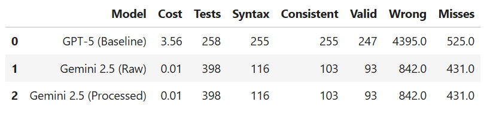
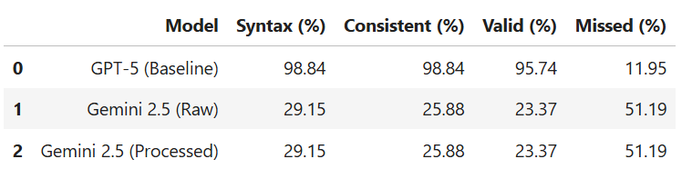
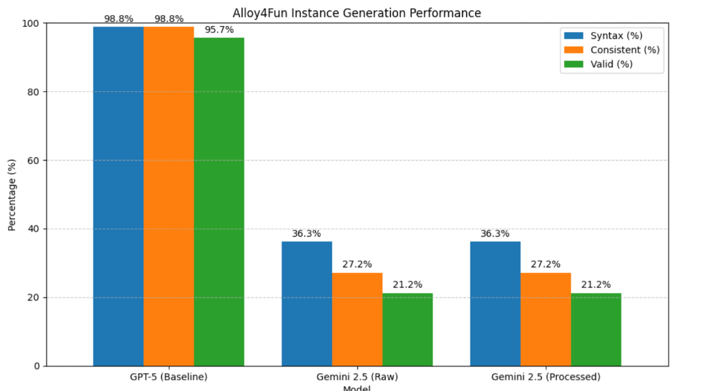
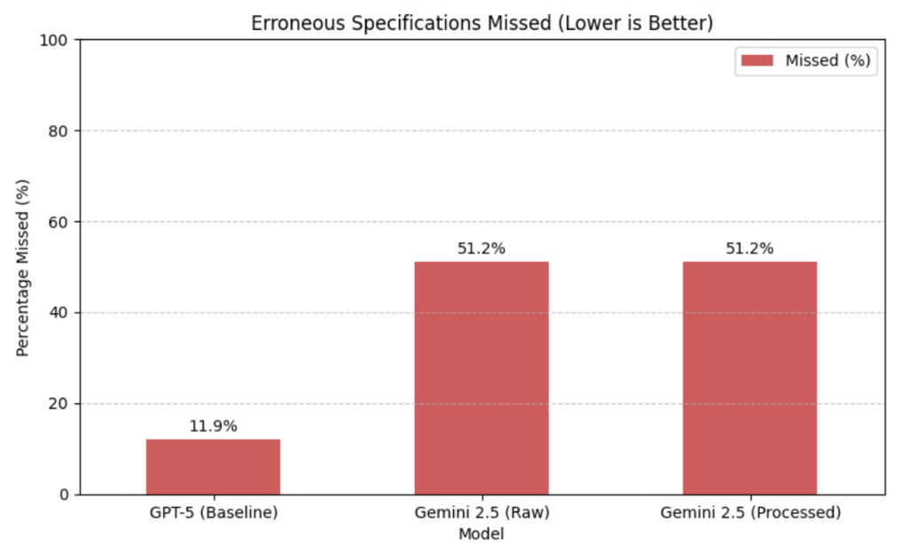

# IF722 – Small LLMs with Multi-Agent Post-Processing for Alloy Test Generation

> Projeto da disciplina IF722 – Tópicos Avançados em Engenharia de Software  
> Universidade Federal de Pernambuco (UFPE)  
> Forked from [haslab/Alloy-LLM-Testing](https://github.com/haslab/Alloy-LLM-Testing)

## Resumo

Este projeto estende o trabalho "Validating Formal Specifications with LLM-generated Test Cases" (FM26) ao investigar se modelos de linguagem menores e mais baratos — especificamente o **Gemini 2.5 Flash** — conseguem gerar casos de teste Alloy com qualidade comparável ao GPT-5, quando assistidos por um pipeline **multi-agente com pós-processamento sintático**.

## Equipe

| Nome | Login UFPE |
|------|-----------|
| Lucas Luis de Souza | lls4 |
| Antonio Apolinario | aab2 |
| Monyque Gabrieli | mgbl |
| Lucas de Holanda | lhl |

## Escopo

O artigo base demonstrou que LLMs grandes (GPT-5) geram test cases Alloy com até 96% de validade usando few-shot prompting. Este projeto questiona: **é possível obter resultados similares com modelos menores e mais baratos, adicionando um agente de correção sintática automática?**

## Perguntas de Pesquisa

- **RQ1:** O pós-processamento sintático reduz significativamente os erros de sintaxe gerados pelo Gemini 2.5 Flash?
- **RQ2:** Com pós-processamento, o Gemini 2.5 Flash consegue detectar especificações incorretas em nível similar ao GPT-5?
- **RQ3:** Qual é a relação custo-benefício entre usar GPT-5 direto vs Gemini 2.5 Flash + pós-processamento?

## Arquitetura Multi-Agente

```
NL Requirement
│
▼
┌─────────────────┐
│    Agent 1      │ → Calls Gemini 2.5 Flash and generates draft Alloy test cases
│   Generator     │
└────────┬────────┘
         │
         ▼
┌─────────────────┐
│    Agent 2      │ → Applies syntax correction rules (scope, run, none, etc.)
│ Post-Processor  │
└────────┬────────┘
         │
         ▼
┌─────────────────┐
│    Agent 3      │ → Runs Alloy Analyzer, collects metrics and decides retry
│   Validator     │
└─────────────────┘
```

## Estrutura do Repositório

```
├── README.md
├── SCOPE.md
├── docs/
│   ├── Relatorio_Final.md     # Relatório detalhado do projeto
│   ├── Apresentacao.md        # Roteiro slide-a-slide da apresentação
│   └── images/                # Imagens dos resultados
├── src/
│   ├── agents/
│   │   ├── agent_generator.py      # Agente 1: geração via Gemini 2.5 Flash
│   │   ├── agent_postprocessor.py  # Agente 2: correção sintática
│   │   └── agent_validator.py      # Agente 3: validação com Alloy Analyzer
│   ├── pipeline.py                 # Orquestrador dos 3 agentes
│   └── config.py                   # Configurações gerais
├── prompts/
│   └── prompt_few_gemini.txt       # Prompt few-shot adaptado para Gemini
├── data/
│   ├── inputs/                     # Requisitos e modelos Alloy do benchmark
│   ├── raw/                        # Saídas brutas do Gemini
│   └── processed/                  # Métricas processadas
├── analysis/                       # Scripts de análise herdados do artigo
├── execute/                        # Scripts de execução herdados do artigo
├── prepare/                        # Scripts de preparação herdados do artigo
├── Dockerfile
├── requirements.txt
└── alloytools.jar
```

## Resultados

O experimento foi executado avaliando o modelo **Gemini 2.5 Flash** (com e sem o pipeline multi-agente de pós-processamento) em comparação ao baseline do **GPT-5**.

Os resultados obtidos a partir do notebook de análise consolidaram as seguintes métricas de desempenho:

### Tabelas Comparativas de Performance

#### Métricas Absolutas


#### Métricas Relativas (%)


### Gráficos Comparativos

#### Desempenho na Geração de Instâncias (Syntax %, Consistent %, Valid %)


#### Taxa de Especificações Incorretas Não Detectadas (Missed %) - Menor é Melhor



## Como Reproduzir o Experimento

Para garantir a total reprodutibilidade metodológica do estudo, detalhamos abaixo o passo a passo de execução.

### 1. Pré-requisitos
- **Python 3.10+**
- **Java JDK (versão 11 ou superior)**: Necessário para rodar o motor do Alloy Analyzer via integração `jpype`.
- Chave de API do Google AI Studio.

### 2. Configuração do Ambiente

Instale as dependências da aplicação:
```bash
pip install -r requirements.txt
```

Configure as variáveis de ambiente necessárias (substitua os caminhos de acordo com o seu sistema operacional):

**No Windows (PowerShell):**
```powershell
$env:GEMINI_API_KEY="sua_chave_aqui"
$env:JAVA_HOME="C:\Program Files\Eclipse Adoptium\jdk-21.0.9.10-hotspot"
```

**No Linux/macOS:**
```bash
export GEMINI_API_KEY="sua_chave_aqui"
export JAVA_HOME="/usr/lib/jvm/java-11-openjdk"
```

### 3. Executando o Pipeline Interativo (Teste Único)
Para interagir com os agentes individualmente e testar o mecanismo de *Self-Reflection* implementado:
```bash
python -m src.pipeline
```
*O terminal pedirá um requisito em linguagem natural e mostrará o log passo a passo dos 3 agentes validando sua entrada.*

### 4. Executando o Benchmark Completo (Processamento em Lote)
Para reproduzir as estatísticas dos 43 requisitos do artigo (430 testes gerados), execute o orquestrador do experimento. Isso pode demorar entre 10 a 15 minutos, pois o script respeita o limite de chamadas (Rate Limit) do *Free Tier* do Gemini.
```bash
python -m src.run_experiment
```
> *A execução salvará os artefatos de saída em `data/raw/experiment_raw.json` e `data/processed/experiment_processed.json`.*

### 5. Extração de Métricas e Gráficos
Para invocar o validador Java e extrair as porcentagens de acerto/erro de cada conjunto:

```bash
# Validando as saídas puras (Raw)
python analysis/analyze.py process alloytools.jar data/raw/experiment_raw.json 0.075 0.30

# Validando as saídas higienizadas (Processed)
python analysis/analyze.py process alloytools.jar data/processed/experiment_processed.json 0.075 0.30
```

Por fim, inicie o Jupyter Notebook para visualizar as tabelas e gráficos idênticos aos da seção "Resultados":
```bash
jupyter notebook analysis/Experiment_Analysis.ipynb
```

### Alternativa: Reprodução via Docker (Opcional)
Caso prefira não instalar Python e Java diretamente na máquina host, toda a reprodução pode ser feita de forma isolada em container.

1. Construa a imagem da aplicação:
```bash
docker build -t alloy-multiagent .
```
2. Rode o pipeline interativo (Equivalente ao Passo 3):
```bash
docker run -it -e GEMINI_API_KEY="sua_chave_aqui" alloy-multiagent python -m src.pipeline
```
3. Rode o experimento em lote (Equivalente ao Passo 4):
```bash
docker run -it -v ${PWD}:/app -e GEMINI_API_KEY="sua_chave_aqui" alloy-multiagent python -m src.run_experiment
```
*(O uso de `-v ${PWD}:/app` é crucial para que os arquivos `.json` gerados dentro do container sejam salvos na sua máquina host e possam ser acessados pelo Jupyter ou pelo script de extração).*

## Baseline

Os resultados do GPT-5 usados como baseline são provenientes do artigo original, disponíveis em [haslab/Alloy-LLM-Testing](https://github.com/haslab/Alloy-LLM-Testing).

